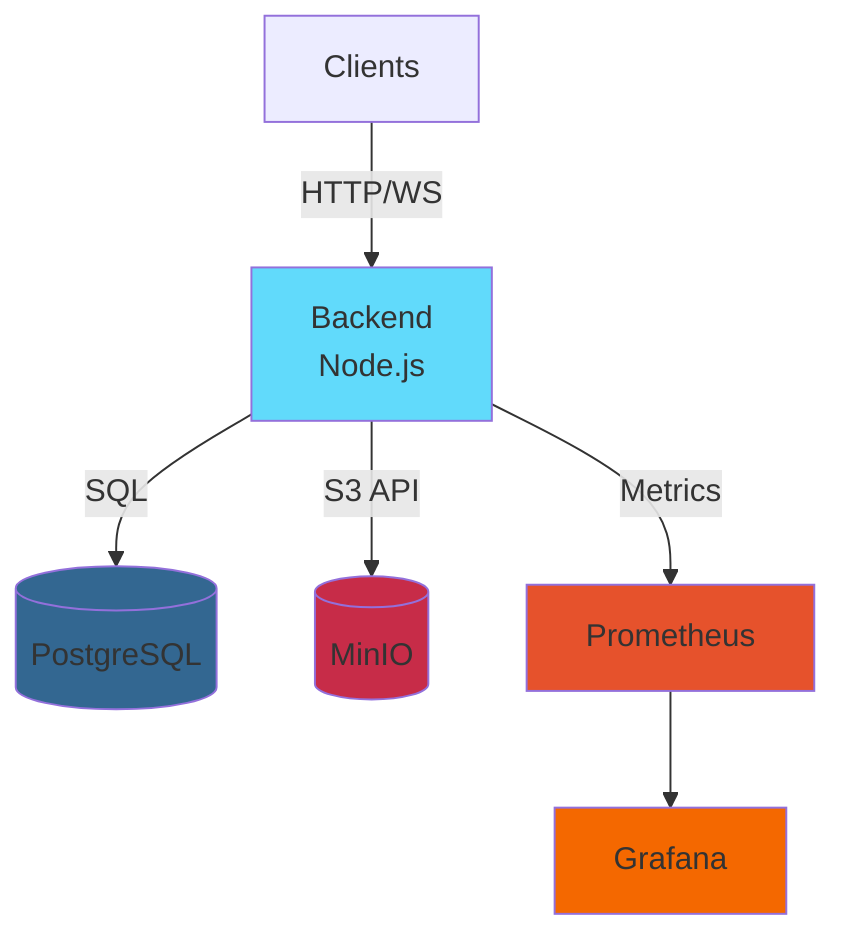

# Landin Collaborative Editor

## Real-time collaborative document editing with CRDT (Y.js) + WebSocket.

---


## Quick Start

```bash
# Setup environment
cp .env.example .env

# Build & run with Docker
docker-compose up --build

# Check services
curl http://localhost:3000/healthz
```

---

## Services & Ports

| Service           | URL                                            | Description                              |
| ----------------- | ---------------------------------------------- | ---------------------------------------- |
| **Backend API**   | [http://localhost:3000](http://localhost:3000) | Express + WebSocket server               |
| **Prometheus**    | [http://localhost:9090](http://localhost:9090) | Metrics monitoring                       |
| **Grafana**       | [http://localhost:3030](http://localhost:3030) | Dashboards (admin/admin)                 |
| **MinIO Console** | [http://localhost:9001](http://localhost:9001) | S3 storage UI (minioadmin/minioadmin123) |
| **MinIO API**     | [http://localhost:9000](http://localhost:9000) | S3-compatible API                        |
| **PostgreSQL**    | localhost:5432                                 | Database (internal)                      |

---

## Verify Setup

### 1. Check Prometheus Targets

```
http://localhost:9090/targets
```

You should see: `collab-backend` = **UP**

### 2. Query Metrics

```
http://localhost:9090/graph
```

Search for:

* `collab_yjs_updates_total` → total number of updates
* `active_connections` → active WebSocket connections
* `persistence_latency_seconds_bucket` → DB write latency

### 3. Grafana Dashboard

```
http://localhost:3030
```

* Login: `admin` / `admin`
* Add Data Source → Prometheus → URL: `http://prometheus:9090`
* Create Dashboard using the above queries

### 4. MinIO Storage

```
http://localhost:9001
```

* Login: `minioadmin` / `minioadmin123`
* Go to Buckets → check the `documents` bucket (for binary assets)

---

## Test API

```bash
# Register user
curl -X POST http://localhost:3000/api/auth/register \
  -H "Content-Type: application/json" \
  -d '{"email":"test@test.com","password":"test123","name":"Test User"}'

# Login & get token
TOKEN=$(curl -s -X POST http://localhost:3000/api/auth/login \
  -H "Content-Type: application/json" \
  -d '{"email":"test@test.com","password":"test123"}' | jq -r '.accessToken')

# Create document
curl -X POST http://localhost:3000/api/documents \
  -H "Authorization: Bearer $TOKEN" \
  -H "Content-Type: application/json" \
  -d '{"title":"My First Doc"}'
```

---

## Docker Services Explained

### **app** (Backend)

* Node.js 20 + TypeScript
* Express API + WebSocket server
* Y.js CRDT engine
* Exposes port **3000**

### **postgres**

* PostgreSQL 15
* Stores: documents, operations, versions, audit logs, users
* Data persisted in `postgres_data` volume

### **minio**

* Self-hosted S3-compatible storage
* Stores binary assets (images)
* Console UI: port **9001**
* API: port **9000**

### **prometheus**

* Metrics collector
* Scrapes `/metrics` from backend every 15 seconds
* Config: `prometheus.yml`
* UI: port **9090**

### **grafana**

* Visualization dashboards
* Connects to Prometheus
* Pre-configured admin user
* Port **3030**

---

## Useful Commands

```bash
# Stop all services
docker-compose down

# Stop + delete volumes (⚠️ deletes all data)
docker-compose down -v

# View logs
docker-compose logs -f app
docker-compose logs -f postgres

# Restart specific service
docker-compose restart app

# Rebuild after code changes
docker-compose up --build app
```

---

## Architecture


---



---

## What Works

* ✅ Real-time collaborative editing (5 users/doc)
* ✅ Live presence (cursors + selections)
* ✅ Version history & revert
* ✅ Granular permissions (OWNER/EDITOR/VIEWER)
* ✅ Long reconnect handling (state vector sync)
* ✅ Audit logging (IP + User-Agent)
* ✅ Binary asset upload (MinIO)
* ✅ Prometheus metrics
* ✅ Health checks

---

